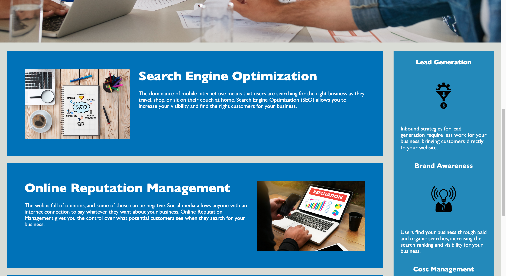
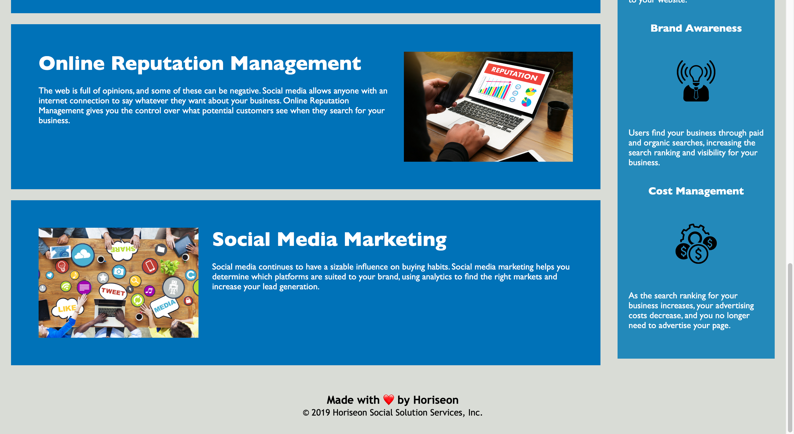

# Challenge-1
UW Bootcamp Challenge 1: HTML, CSS and Git: Code Refactor

# Challenge  Requirements
## User Story

```
AS A marketing agency
I WANT a codebase that follows accessibility standards
SO THAT our own site is optimized for search engines
```

## Acceptance Criteria

```
GIVEN a webpage meets accessibility standards
WHEN I view the source code
THEN I find semantic HTML elements
WHEN I view the structure of the HTML elements
THEN I find that the elements follow a logical structure independent of styling and positioning
WHEN I view the icon and image elements
THEN I find accessible alt attributes
WHEN I view the heading attributes
THEN they fall in sequential order
WHEN I view the title element
THEN I find a concise, descriptive title
```
# Installation

To meet above criteria I began by replacing all the div tags in the starter code with the proper semantic elements. By referring to this [HTML Semantic Elements Guide](https://www.w3schools.com/html/html5_semantic_elements.asp) found online I was able to make sure the HTML elements followed a logical structure independent of styling and positioning. Following this I was able to meet the remaining criteria by adding alt attributes to the image files, changing the last h2 in the footer element to h4 so all the header attributes fall in sequential order, and changed the title element from *website* to *Horiseon Social Solution Services*. I proceeded to refactor the style.css file by removing instances of repeat code and consolidating them into a single class. Finally I relayed all the changes made in the .html to the .css and vice versa so the two files would communicate the same and allow the website to function correctly.

# Usage





